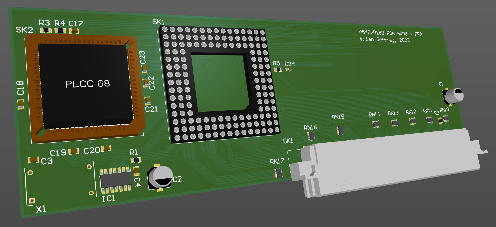

# Acorn A540/R260 ARM3 processor card with FPA

July 2023

This is my implementation of an ARM3 processor card for Acorn A540/R260 machines, with FPA socket.
The ARM3 is of the PGA144 variety.

One has been built and tested with a plastic PGA ARM3 and FPA10 - all operated as expected.

## Licence

No warranty is provided, and this work is used at your own risk.  

Licenced as CC BY-SA 3.0

Copyright 2023 Ian Jeffray

